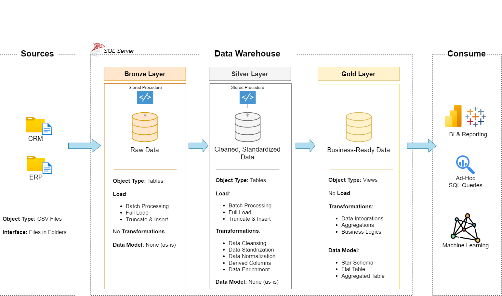

# SQL Data Warehouse Project

A complete, production-ready SQL Data Warehouse project implementing the medallion architecture (Bronze, Silver, Gold) featuring robust T-SQL ETL, star schema data modeling and a unified data catalog for analytics and business intelligence.

---

## Table of Contents

- [Overview](#overview)
- [Architecture](#architecture)
- [Medallion Layers](#medallion-layers)
- [Data Modeling](#data-modeling)
- [Naming Conventions](#naming-conventions)
- [Data Catalog](#data-catalog)
- [Project Structure](#project-structure)
- [Getting Started](#getting-started)
- [How to Use](#how-to-use)
- [Contributing](#contributing)
- [License](#license)

---

## Overview

This project delivers a robust Data Warehouse (DWH) solution using T-SQL, following the medallion architecture to systematically refine and curate data through three layers:

- **Bronze:** Raw data ingestion  
- **Silver:** Cleansed and conformed data  
- **Gold:** Analytics-ready, star schema modeled data  

The solution is modular, auditable and scalable, enabling advanced analytics and self-service BI.

---

## Architecture



- **Bronze Layer:** Raw ingestion from all source systems, preserving original structure.
- **Silver Layer:** Data cleansing, deduplication and business rule application.
- **Gold Layer:** Star schema presentation with business-friendly fact and dimension tables.

---

## Medallion Layers

- **Bronze:**  
  - Raw, unprocessed data as received from source systems (e.g., CRM, ERP).
  - Table naming: `<sourcesystem>_<entity>`.
- **Silver:**  
  - Cleansed, standardized and integrated data.
  - Maintains traceability.
- **Gold:**  
  - Star schema: `dim_<entity>` and `fact_<entity>` tables for analytics and reporting.

ETL scripts for each layer are modular and found in `scripts/bronze`, `scripts/silver` and `scripts/gold`.

---

## Data Modeling

- **Star Schema** for the Gold layer:
  - **Dimension Tables** (e.g., `dim_customers`, `dim_products`): descriptive, slowly changing attributes.
  - **Fact Tables** (e.g., `fact_sales`): transactional, numeric measures with foreign keys to dimensions.
- **Surrogate keys** for dimension tables (`*_key`).
- **Technical columns** prefixed with `dwh_` (e.g., `dwh_create_date`).

---

## Naming Conventions

- **Tables:**  
  - Bronze/Silver: `<sourcesystem>_<entity>`
  - Gold: `dim_<entity>`, `fact_<entity>`
- **Columns:**  
  - Surrogate keys: `<entity>_key`
  - Technical: `dwh_<name>`
- **Procedures:**  
  - ETL: `load_<layer>`

See [`documentation/naming_conventions.md`](documentation/naming_conventions.md) for full details.

---

## Data Catalog

A unified data catalog documents all Gold layer tables, columns, data types and business definitions.

See [`documentation/data_catalog.md`](documentation/data_catalog.md) for full details.

**Sample entries:**
- `dim_customers`: Customer metadata
- `dim_products`: Product attributes
- `fact_sales`: Sales transactions

---

## Project Structure

```text
sql_data_warehouse_project/
│
├── documentation/
│   ├── data_architecture.png      # Medallion architecture diagram
│   ├── data_catalog.md            # Unified data catalog for Gold layer
│   └── naming_conventions.md      # Naming standards for DWH objects
│
├── scripts/
│   ├── init_database.sql          # Database and schema initialization
│   ├── bronze/                    # ETL scripts for Bronze layer
│   ├── silver/                    # ETL scripts for Silver layer
│   └── gold/                      # ETL scripts for Gold layer (star schema)
│
└── README.md
```

---

## Getting Started

1. **Clone the Repository:**
   ```bash
   git clone https://github.com/pavithra19/sql_data_warehouse_project.git
   cd sql_data_warehouse_project
   ```

2. **Review Documentation:**  
   See `documentation/` for architecture, conventions and the data catalog.

3. **Initialize Database:**  
   Execute `scripts/init_database.sql` to set up schemas and base objects.

4. **Run ETL Scripts:**  
   Follow the sequence in `scripts/bronze`, `scripts/silver`, then `scripts/gold`.

5. **Consult Data Catalog:**  
   Use `documentation/data_catalog.md` for detailed table and column descriptions.

---

## How to Use

- Extend ETL scripts for new sources or business rules.
- Use Gold layer tables for dashboards, analytics and BI.
- Follow naming and modeling standards for further development.

---

## Contributing

Contributions are welcome! Please create issues or submit pull requests for enhancements, fixes, or new features.

---

## License

This project is licensed under the MIT License.

---

**For more on star schema, table definitions and lineage, see the unified data catalog in `documentation/data_catalog.md`.**
